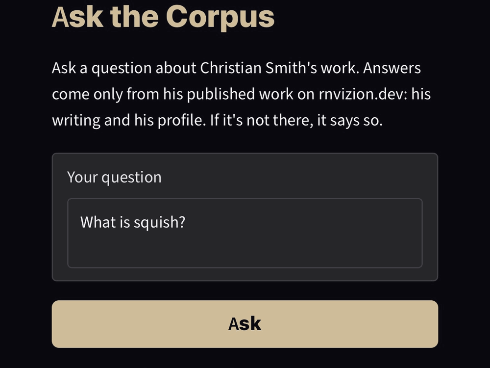

# Ask the Corpus

A retrieval-augmented (RAG) chatbot that answers questions about Christian “RNVizion” Smith’s published writing — grounded only in the source, and honest about what it doesn’t cover.

**Live demo:** <https://huggingface.co/spaces/RNVizion/ask-the-corpus>

-----

## Demo

[](assets/ask-the-corpus-demo.mp4)

A 30-second walkthrough: ask a question, get a grounded answer with the post it came from, then watch it decline something the blog never covered. Honesty is the design goal, not an afterthought.

-----

## What it does

Ask it anything about the blog. It retrieves the most relevant passages from the published posts, hands them to Claude, and answers *only* from that context. Ask it something the blog doesn’t cover (the capital of China, say) and it tells you so instead of guessing.

Three things make it more than a wrapper around an LLM:

- **Grounded.** Answers are built from retrieved passages, not the model’s own knowledge. Every answer names the post it drew from.
- **Published-only.** The ingester pulls from live, published pages on rnvizion.dev — never local drafts. What’s on the site is what the bot knows.
- **Guardrailed.** An input-length cap, per-client rate limits, a bounded answer length, and a system prompt that refuses anything outside the corpus.

## How it works

```
published posts  ->  ingest.py  ->  chunks  ->  embeddings  ->  ChromaDB
                                                                   |
question  ->  embed  ->  similarity search (top-k)  ->  context  -+
                                                          |
                              context + question  ->  Claude  ->  grounded answer
```

1. **Ingest** (`ingest.py`): fetches each published post, strips the page chrome, splits the body into overlapping chunks, embeds them with `all-MiniLM-L6-v2`, and stores them in a local ChromaDB collection.
1. **Retrieve** (`app.py`): embeds the question with the same model, pulls the top-k most similar chunks from Chroma.
1. **Answer** (`app.py`): sends the retrieved context plus the question to Claude with a system prompt that allows answers *only* from the context, and returns a concise, sourced reply.

## Guardrails

|Guardrail             |Why                                        |
|----------------------|-------------------------------------------|
|Max input length      |Bounds cost and blocks prompt-stuffing     |
|Top-k retrieval       |Keeps the context window small and on-topic|
|Max output tokens     |Caps the cost of any single answer         |
|Per-client rate limit |Protects the demo budget from abuse        |
|Grounded system prompt|Answers come from the corpus, or not at all|

## Stack

- **Embeddings:** sentence-transformers (`all-MiniLM-L6-v2`)
- **Vector store:** ChromaDB (persistent, committed to the repo)
- **LLM:** Claude (Haiku) via the Anthropic API
- **UI:** Gradio
- **Deploy:** Hugging Face Spaces

## Run it locally

```bash
git clone https://github.com/RNVizion/ask-the-corpus
cd ask-the-corpus
pip install -r requirements.txt
export ANTHROPIC_API_KEY=sk-ant-...   # your key

python ingest.py     # builds the Chroma index from the published posts
python app.py        # serves the Gradio app at http://localhost:7860
```

The index is committed, so you can skip `ingest.py` and run `app.py` straight away; re-run `ingest.py` only when the posts change.

## Deploy

The live demo runs on Hugging Face Spaces. `app.py`, `requirements.txt`, and the prebuilt `chroma/` index are uploaded to the Space; the Anthropic key is set as a Space secret (`ANTHROPIC_API_KEY`). The Space rebuilds on upload.

## Repo layout

```
ingest.py          # published-only ingester -> ChromaDB
app.py             # retrieval + Claude + Gradio UI
requirements.txt
chroma/            # prebuilt vector index (committed)
assets/            # demo clip and screenshots
```

## Design note: why published-only

The ingester only reads pages that are live on rnvizion.dev. Drafts, private notes, and work-in-progress never enter the index. The bot’s knowledge is exactly the public surface of the site — nothing leaks, and “what it knows” stays honest.

## Author

Christian “RNVizion” Smith — Python developer, AR/VR specialist at Meta.
[rnvizion.dev](https://rnvizion.dev) · [GitHub](https://github.com/RNVizion) · [LinkedIn](https://www.linkedin.com/in/christian-smith-40b957161/)
